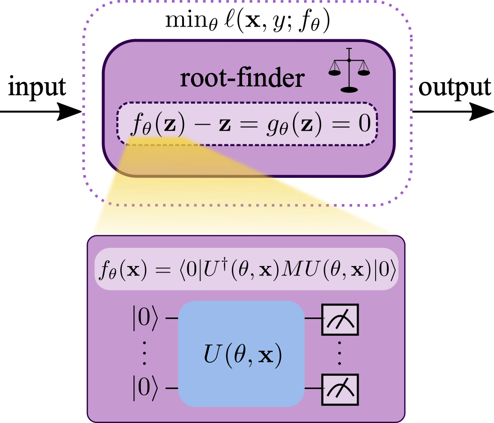

<h1 align="center">Quantum Deep Equilibrium (QDEQ) Models</h1>

 <p align="center">
 <a href=""></a>
</p>


This is the official code repository for **Quantum Deep Equilibrium Models** (QDEQ), a framework for training quantum machine learning (QML) models using implicit differentiation. Our framework is based on the deep equilibrium transformer (DEQ-Transformer) model presented in [Deep Equilibrium Models](https://arxiv.org/abs/1909.01377) by Bai et al.

 <p align="center">

</p>


### Requirements
```
Python >= 3.8
TorchQuantum
PyTorch 1.13.0
```


### Installation instructions:
1.  Clone this repository
2. Create a new conda environment with Python 3.8 (e.g. `conda create -n qdeq python==3.8`)
3. Install PyTorch 1.130 :
  `pip install torch==1.13.0+cu117 --extra-index-url https://download.pytorch.org/whl/cu117` (adjusting for your system's CUDA version)
4. Install TorchQuantum with: `git clone https://github.com/mit-han-lab/torchquantum.git` -- in `requirements.txt`, comment out the lines with `torch` and `torchvision`. Then, in your clone, run `pip install -e .`
5. Finally, install WandB with `pip install wandb`


### Code layout:
The main training script can be found in the `DEQ-Quantum` directory:
```
train_qdeq.py
```
The models can be found in:

```
models/qdeq_model.py
```

Data loading scripts for MNIST and CIFAR are, respectively, in:

```
load_mnist.py
load_cifar.py
```

To train and evaluate a model, you can use one of the bash scripts in this repository (for example, `bash_scripts/qdeq_mnist.sh`). Run `bash bash_scripts/qdeq_mnist.sh train` to train the model. You can indiciate certain flags depending on what mode you want to train in. For instance, specify `--direct` if you want to use a direct solver instead of the implidict one. `n_layer` allows you to specify how many times to apply the model in the direct solver or warmup phase. To perform a warmup phase before implicit differentation, specify `--pretrain_steps` followed by the number of pretraining steps.

One setting could be:

```
cd DEQ-Quantum
python3 train_qdeq.py --optim Adam --lr 0.005 --cuda --scheduler constant --max_step 18800 --pretrain_steps 0 --mode implicit --n_layer 0 --name qdeq_mnist_warmup_10c --f_solver broyden --b_solver broyden --stop_mode rel --f_thres 10 --b_thres 10 --jac_loss_weight 0.8 --jac_loss_freq 1 --jac_incremental 0 --batch_size 256 --rand_f_thres_delta 2 --log-interval 188 --eval-interval 188 --num_classes 10 --n_wires 10 --dataset mnist
```

### Citation:
```
@inproceedings{schleich2024qdeq,
    title     = {Quantum Deep Equilibrium Models},
    author    = {Schleich, Philipp and Skreta, Marta and Kristensen, Lasse Bj{\o}rn, and Vargas-Hern{\'a}ndez, Rodrigo A. and Aspuru-Guzik, Al{\'a}n},
    booktitle = {Advances in Neural Information Processing Systems},
    year      = {2024}
}
```
